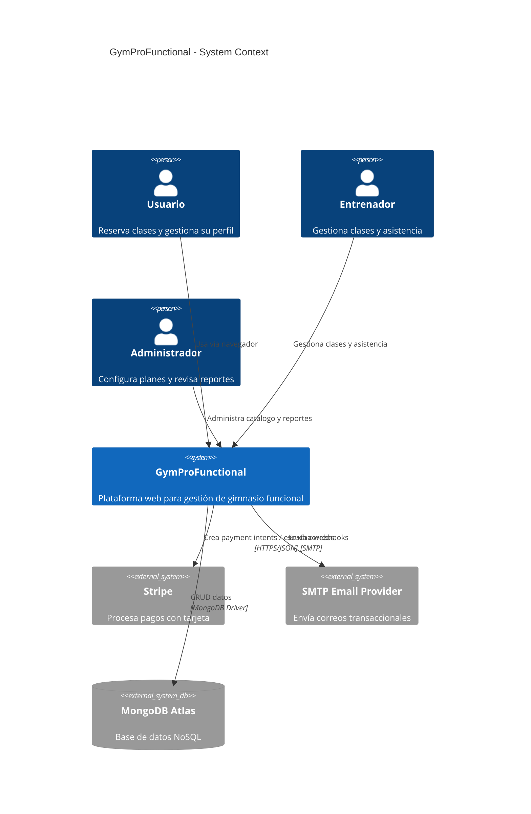
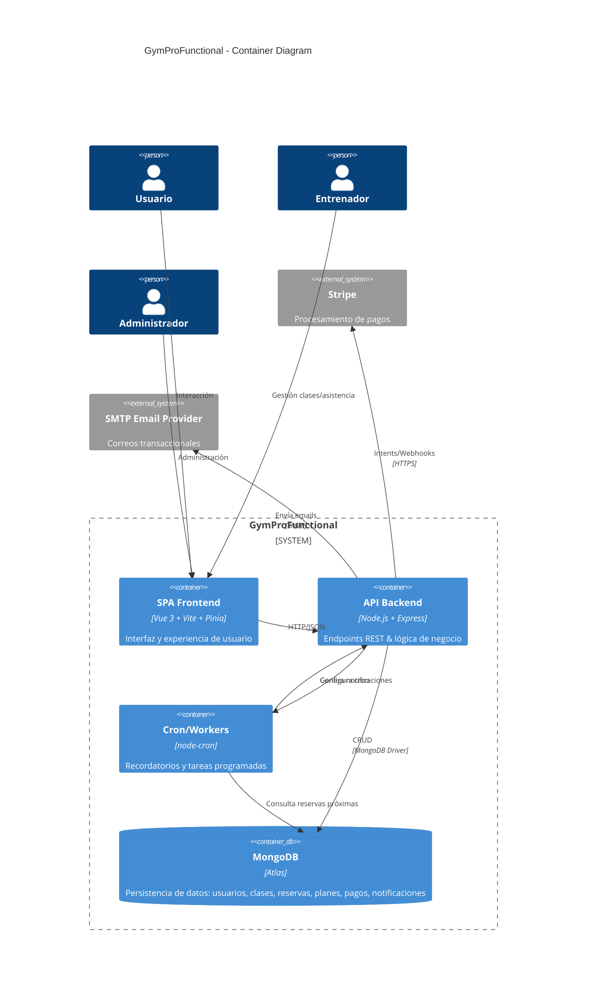
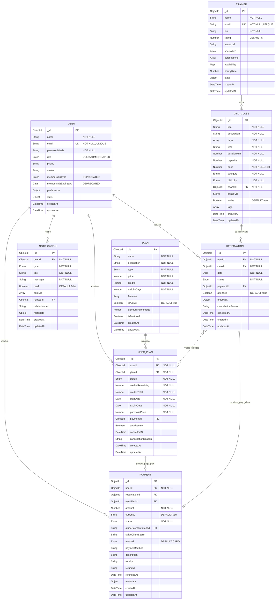
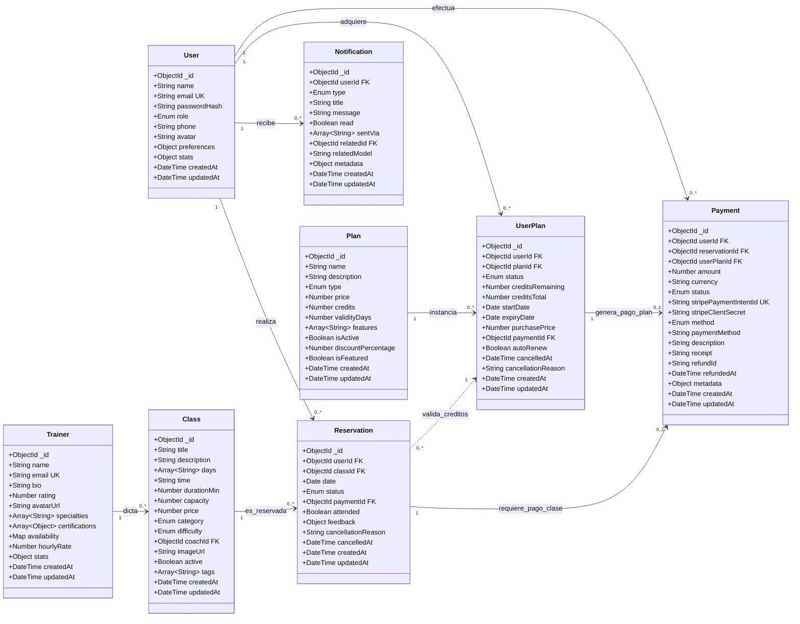
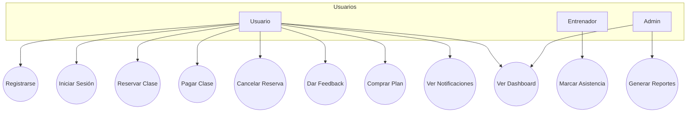
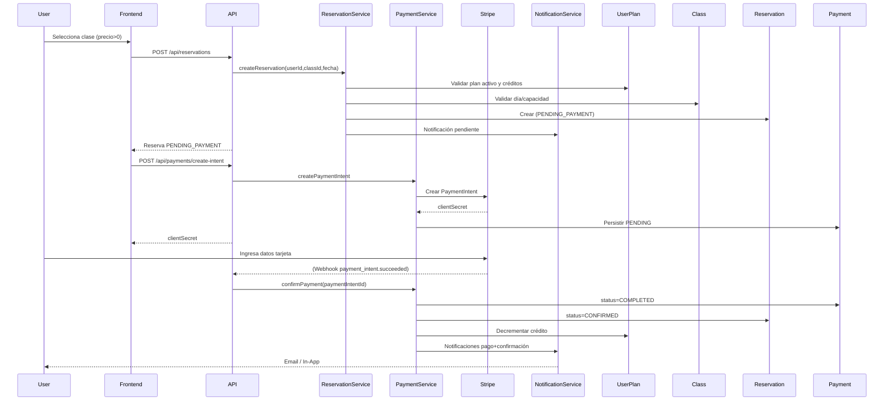
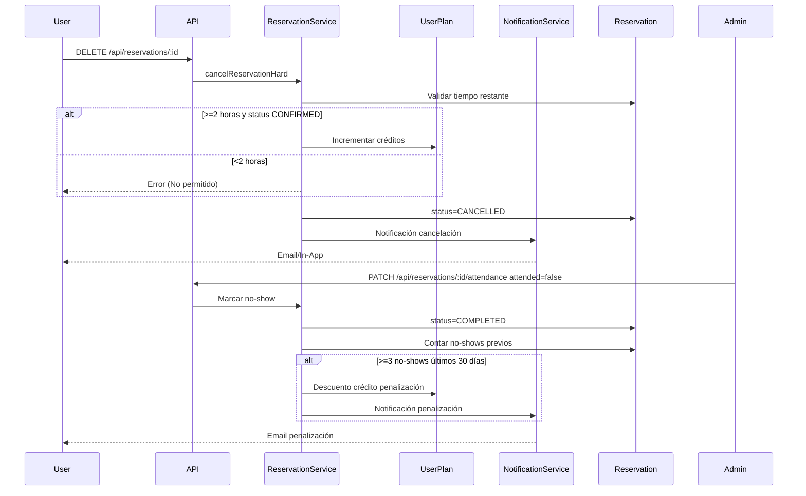

# 📘 Documentación Técnica del Sistema – GymProFunctional

> Fecha de actualización: 2025-11-06
> Versión: 1.0

## Índice

1. Introducción
2. Alcance y Objetivos
3. Arquitectura (C4 Nivel 1 y 2)
4. Modelo de Datos (Esquemas y Relaciones)
5. Flujos Principales
6. Diagramas UML
7. Diferencias: Planificado vs Implementado
8. Seguridad y Consideraciones Técnicas
9. Estrategia de Notificaciones y Background Jobs
10. KPIs y Métricas
11. Próximas Mejoras Recomendadas

---

## 1. Introducción

GymProFunctional es una plataforma full‑stack para la gestión operativa de un gimnasio funcional: reservas de clases, compra y consumo de planes (créditos), pagos, notificaciones transaccionales y paneles de estadísticas para distintos roles (Usuario, Entrenador, Admin).


---


## 2. Alcance y Objetivos

- Gestión de usuarios con roles diferenciados.
- Reservas con validación de capacidad, calendario y reglas de cancelación.
- Sistema de planes con créditos y fechas de expiración.
- Pagos integrados (Stripe / modo test) y lógica de confirmación.
- Penalización por no‑show y devolución de créditos bajo condiciones.
- Notificaciones multicanal (IN_APP / EMAIL) y recordatorios programados.
- KPIs: ocupación, no‑show, ingresos, comportamiento por rol.

---


## 3. Arquitectura (C4)

### 3.1 Diagrama de Contexto (Nivel 1)



### 3.2 Diagrama de Contenedores (Nivel 2)



---


## 4. Modelo de Datos Relacional Normalizado

### 4.1 Diagrama Entidad-Relación (Notación Chen Extendida)



### 4.2 Relaciones Clave y Normalización

#### **Relaciones Físicas (Foreign Keys)**

- `USER 1→N RESERVATION`: Un usuario realiza múltiples reservas (`Reservation.userId → User._id`)
- `USER 1→N USER_PLAN`: Un usuario adquiere múltiples planes (`UserPlan.userId → User._id`)
- `USER 1→N PAYMENT`: Un usuario efectúa múltiples pagos (`Payment.userId → User._id`)
- `USER 1→N NOTIFICATION`: Un usuario recibe múltiples notificaciones (`Notification.userId → User._id`)
- `TRAINER 1→N GYM_CLASS`: Un entrenador dicta múltiples clases (`Class.coachId → Trainer._id`)
- `GYM_CLASS 1→N RESERVATION`: Una clase recibe múltiples reservas (`Reservation.classId → Class._id`)
- `PLAN 1→N USER_PLAN`: Un plan se instancia en múltiples compras (`UserPlan.planId → Plan._id`)
- `USER_PLAN 1→0..1 PAYMENT`: Un plan genera opcionalmente un pago (`UserPlan.paymentId → Payment._id`)
- `RESERVATION 1→0..1 PAYMENT`: Una reserva puede requerir un pago (`Reservation.paymentId → Payment._id`)

#### **Relaciones Lógicas (Sin Foreign Key)**

- `RESERVATION N→N USER_PLAN` _(línea punteada)_: Una reserva valida créditos del plan activo del usuario en tiempo de ejecución. **No existe FK `userPlanId` en Reservation**. La lógica de negocio busca el plan activo mediante: `UserPlan.findOne({ userId, status: 'ACTIVE', creditsRemaining: { $gt: 0 } })`

#### **Análisis de Normalización (3NF/BCNF)**

**Primera Forma Normal (1NF)** ✅

- Todos los atributos contienen valores atómicos
- Arrays modelados como tipos nativos BSON (MongoDB)

**Segunda Forma Normal (2NF)** ✅

- Cumple 1NF
- Todos los atributos no clave dependen completamente de la clave primaria

**Tercera Forma Normal (3NF)** ✅

- Cumple 2NF
- No hay dependencias transitivas
- Ejemplo: `Class.coachId` referencia `Trainer._id`, evitando redundancia

**Forma Normal de Boyce-Codd (BCNF)** ⚠️ Parcial

- `User.membershipType` y `User.membershipExpiresAt` son **redundantes** con `UserPlan` (campos deprecados)

### 4.3 Reglas de Integridad Referencial

| Tabla        | Campo FK      | Referencia       | On Delete | On Update |
| ------------ | ------------- | ---------------- | --------- | --------- |
| GYM_CLASS    | coachId       | TRAINER.\_id     | RESTRICT  | CASCADE   |
| RESERVATION  | userId        | USER.\_id        | CASCADE   | CASCADE   |
| RESERVATION  | classId       | GYM_CLASS.\_id   | RESTRICT  | CASCADE   |
| RESERVATION  | paymentId     | PAYMENT.\_id     | SET NULL  | CASCADE   |
| USER_PLAN    | userId        | USER.\_id        | CASCADE   | CASCADE   |
| USER_PLAN    | planId        | PLAN.\_id        | RESTRICT  | CASCADE   |
| USER_PLAN    | paymentId     | PAYMENT.\_id     | SET NULL  | CASCADE   |
| PAYMENT      | userId        | USER.\_id        | CASCADE   | CASCADE   |
| PAYMENT      | reservationId | RESERVATION.\_id | SET NULL  | CASCADE   |
| PAYMENT      | userPlanId    | USER_PLAN.\_id   | SET NULL  | CASCADE   |
| NOTIFICATION | userId        | USER.\_id        | CASCADE   | CASCADE   |

### 4.4 Índices Optimizados

```javascript
// USER
db.users.createIndex({ email: 1 }, { unique: true });
db.users.createIndex({ role: 1 });

// TRAINER
db.trainers.createIndex({ email: 1 }, { unique: true });

// CLASS
db.classes.createIndex({ coachId: 1 });
db.classes.createIndex({ active: 1, category: 1, difficulty: 1 });

// RESERVATION
db.reservations.createIndex({ userId: 1, classId: 1, date: 1 });
db.reservations.createIndex({ classId: 1, date: 1, status: 1 });
db.reservations.createIndex({ userId: 1, status: 1 });

// USER_PLAN
db.userPlans.createIndex({ userId: 1, status: 1 });
db.userPlans.createIndex({ expiryDate: 1, status: 1 });

// PAYMENT
db.payments.createIndex({ userId: 1, createdAt: -1 });
db.payments.createIndex(
  { stripePaymentIntentId: 1 },
  { unique: true, sparse: true }
);
db.payments.createIndex({ status: 1 });

// NOTIFICATION
db.notifications.createIndex({ userId: 1, read: 1, createdAt: -1 });
db.notifications.createIndex({ type: 1, createdAt: -1 });
```

### 4.5 Diagrama de Clases UML (Versión Corregida con Cardinalidades Reales)



**Correcciones Aplicadas:**

1. ✅ **UserPlan → Payment**: Cambiado de `1:*` a `1:0..1` (un plan genera máximo 1 pago)
2. ✅ **Reservation → Payment**: Cambiado a `1:0..1` (clases gratuitas no requieren pago)
3. ✅ **Reservation ..> UserPlan**: Relación lógica con línea punteada `..>` (sin FK físico, validación en runtime)
4. ✅ **Dirección LR**: Layout horizontal profesional

---


## 5. Flujos Principales

### 5.1 Autenticación

1. `POST /api/auth/register` valida unicidad email, hashea contraseña, crea usuario, devuelve JWT (30m exp, código actual: valor corto vs documentación inicial que hablaba de 7 días).
2. `POST /api/auth/login` busca email, compara hash, emite JWT.
3. Middleware `requireAuth` añade `req.user` (id, role) para rutas protegidas.

### 5.2 Reserva de Clase (Gratis)

1. Usuario selecciona clase y fecha válida (día dentro de `days`).
2. Verifica existencia de plan activo con créditos.
3. Crea `Reservation` con estado `CONFIRMED` si `price=0` y descuenta crédito del `UserPlan`.
4. Genera notificación `RESERVATION_CONFIRMED` (EMAIL + IN_APP).

### 5.3 Reserva de Clase (De Pago)

1. Crea `Reservation` en `PENDING_PAYMENT`.
2. Genera notificación de pendiente.
3. `POST /api/payments/create-intent` → crea Payment intent (Stripe) y `Payment` interno.
4. Al confirmar pago (webhook o confirm manual):
   - `Payment.status=COMPLETED`
   - `Reservation.status=CONFIRMED`
   - Descuenta crédito de `UserPlan`.
   - Notificaciones: `PAYMENT_CONFIRMATION` + `RESERVATION_CONFIRMED`.

### 5.4 Cancelación de Reserva

- Permite cancelar si faltan ≥ 2h (devuelve crédito si estaba `CONFIRMED`).
- Actualiza `Reservation.status=CANCELLED`.
- Notificación `RESERVATION_CANCELLED` (mensajes distintos si crédito devuelto).

### 5.5 Penalización por No‑Show

- Admin/Trainer marca asistencia (`PATCH /api/reservations/:id/attendance`).
- Si se marca no asistido y acumula ≥3 no‑shows últimos 30 días: se descuenta crédito adicional y se genera notificación de penalización.

### 5.6 Compra de Plan

- Usuario inicia `POST /api/plans/:id/purchase` → crea `UserPlan` (PENDING_PAYMENT) + `Payment`.
- Confirma pago → `UserPlan.status=ACTIVE`, notificación `PLAN_PURCHASED`.

### 5.7 Recordatorios Programados

- `node-cron` dispara cada hora: busca reservas en ventana 24h y 2h → crea notificaciones `CLASS_REMINDER_24H` / `CLASS_REMINDER_2H`.

### 5.8 Estadísticas / KPIs

- `GET /api/stats/dashboard` calcula distintas métricas según rol con agregaciones Mongo.
- KPIs ocupación y no‑show (`/api/stats/occupancy-noshow`) agrupan por clase, día y usuario para ranking.

---


## 6. Diagramas UML

### 6.1 Caso de Uso (Resumen Funcional)



### 6.2 Secuencia: Reserva de Clase de Pago



### 6.3 Secuencia: Cancelación con Devolución + Penalización No‑Show



---


## 7. Diferencias: Planificado vs Implementado

| Aspecto                        | Planificado (según README/visión inicial) | Implementado Actual                                   | Observaciones                                         |
| ------------------------------ | ------------------------------------------- | ----------------------------------------------------- | ----------------------------------------------------- |
| Expiración JWT                | 7 días                                     | 30 minutos (`JWT_EXPIRES_IN`)                       | Reducido; considerar refresh tokens.                  |
| Webhooks Stripe                | Confirmación automática completa          | Parsing básico sin verificación firma               | Falta `stripe.webhooks.constructEvent` y seguridad. |
| Membresías `membershipType` | Se menciona en `User`                     | No integrada con Planes (`UserPlan`)                | Atributo legacy, potencial refactor.                  |
| Feedback general               | Clases calificables                         | Implementado `reservation.feedback`                 | OK, pendiente endpoints listados globales.            |
| Reembolsos                     | Gestión admin + lógica                    | Método `refundPayment` básico                     | Falta política de créditos y verificación.         |
| Roles Entrenador               | CRUD completo                               | Trainer existe, creación vía seed                   | Falta endpoints creación/edición trainer.           |
| Notificaciones Push            | Multi-canal (incluye PUSH)                  | Campo `sentVia`, pero sin implementación real push | Requiere integración service worker / FCM.           |
| Seguridad SMTP                 | Emails transaccionales                      | SMTP condicional, sin backend queue                   | Podría añadirse reintentos y logs persistentes.     |
| Testing Automatizado           | Suite de tests                              | Solo guía manual (`TESTING_GUIDE.md`)              | Pendiente Jest/Supertest + coverage.                  |
| Auditoría / Logs              | Mencionado como mejora                      | Logs consola simples                                  | Recomendado: Winston + niveles + persistencia.        |
| CI/CD                          | Escalable                                   | No presente                                           | Añadir GitHub Actions (lint, test, build).           |

---


## 8. Seguridad y Consideraciones Técnicas

- Autenticación: JWT corto + recomendación refresh.
- Hash contraseñas: `bcryptjs` salt=10.
- Validación de fecha y capacidad en reservas con índices (`reservationSchema.index`).
- Falta rate limiting (login, reservas) → sugerido `express-rate-limit`.
- Webhook Stripe sin verificación firma: riesgo de spoofing.
- Falta sanitización de entrada avanzada (posible uso `express-validator`).
- SMTP sin cola asíncrona: riesgo de bloqueo si servidor lento.

---


## 9. Estrategia de Notificaciones y Background Jobs

`node-cron` ejecuta tareas por hora:

- Recordatorios 24h y 2h antes → crea notificaciones + email.
- Penalizaciones en asistencia tratadas ad-hoc en endpoint de patch.
  Sugerencias: mover lógica de penalización y expiración de planes a job diario.

---


## 10. KPIs y Métricas

`stats.service.js` implementa agregaciones:

- Admin: ingresos, reservas por estado, usuarios nuevos, ocupación promedio, clases populares.
- Trainer: reservas en sus clases, estudiantes únicos, ingresos asociados, distribución por día.
- User: reservas propias, gasto, clase favorita, tasa de asistencia.
- KPIs especializados: ocupación vs no‑show, ranking de usuarios con más ausencias.

---


## 11. Próximas Mejoras Recomendadas

- Implementar verificación de firma Stripe y manejo de eventos adicionales (failed, canceled).
- Agregar tests automatizados: Jest + Supertest.
- Implementar refresh tokens y lista de revocación.
- Migrar a colas (BullMQ/Redis) para emails y recordatorios.
- Endpoint de administración para métricas en tiempo real.
- Integración PUSH (Service Worker + FCM).
- Normalización de feedback en entidad separada para análisis avanzado.
- Hardening de seguridad (helmet, rate limiting, cors restrictivo por entorno).

---
